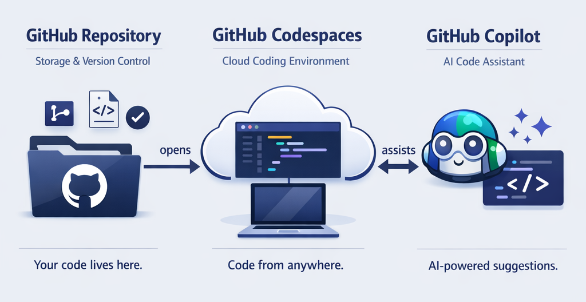
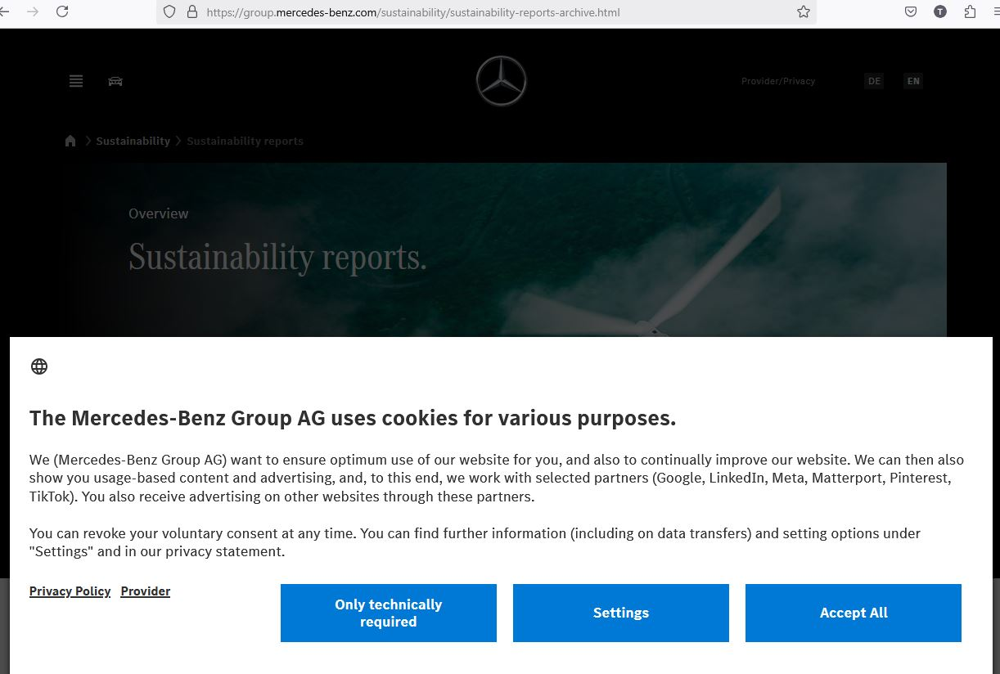
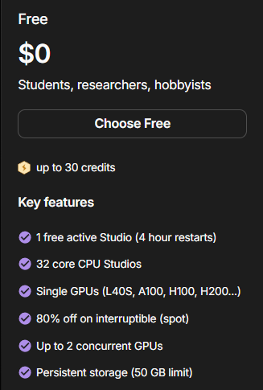
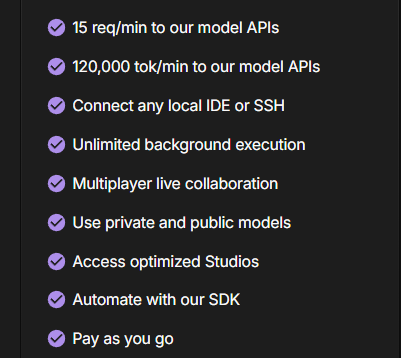
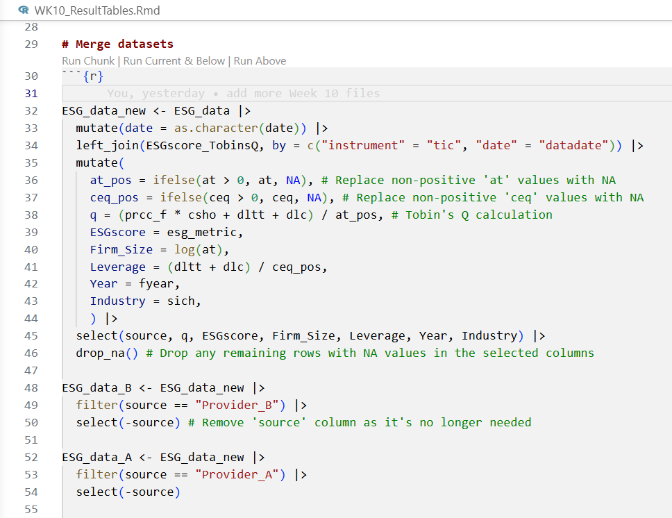
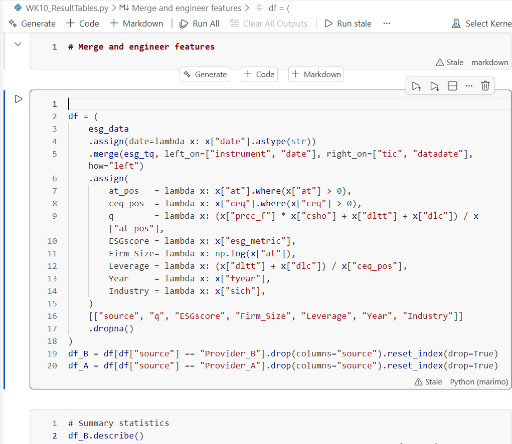
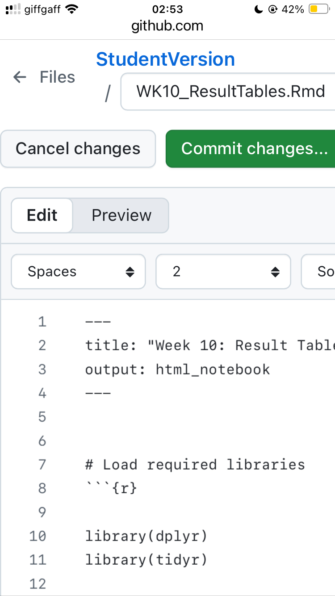
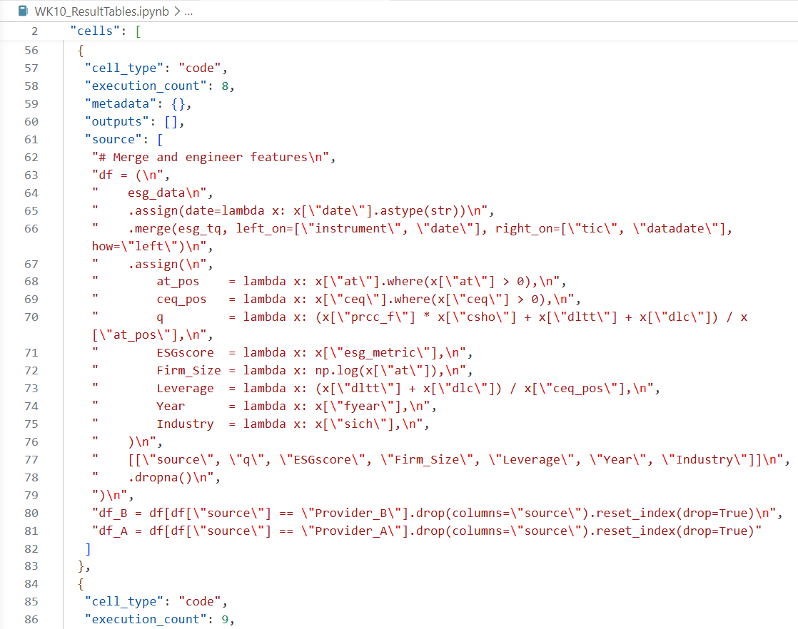
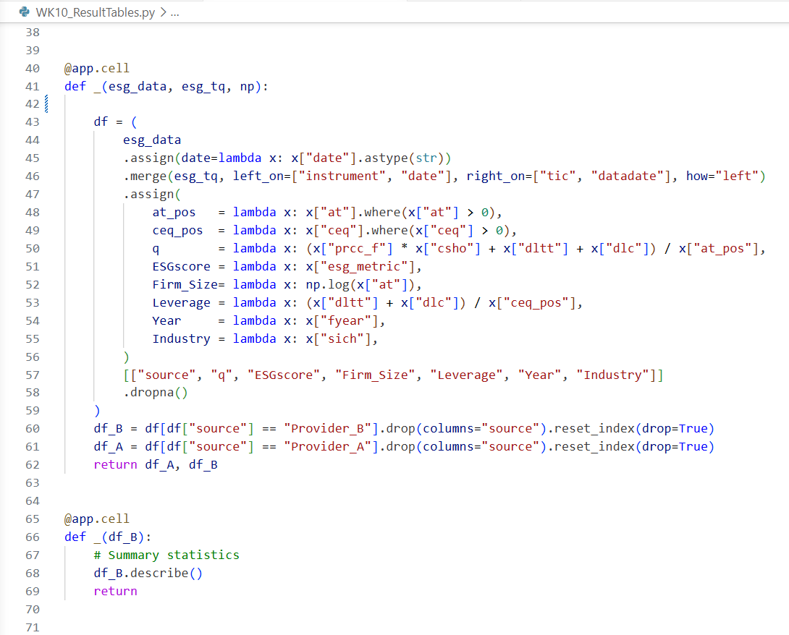
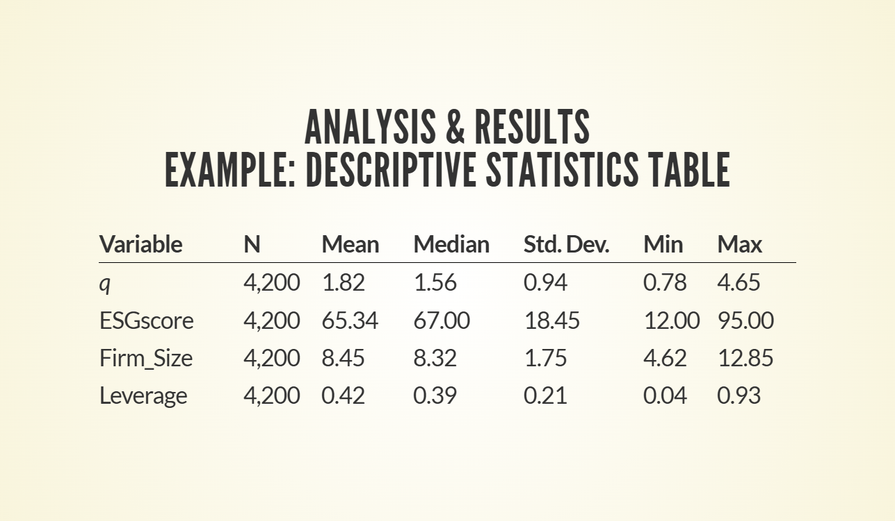

# The problem to solve {.Xsmaller}

- You have a task that can be ***automated with code***

- You want to know how an ***AI assistant*** can help


# Why automation with code? {.smaller}

::: incremental
- **Repetitive tasks** can be automated to *save time and reduce errors*
- **Scalability**: Automation allows *scaling out in parallel* if needed
- **Scheduled tasks** can be automated to run at specific times *without
  human attention*
- **Judgment-based tasks** can be automated with *AI acting as your
  surrogate*
- **Complex tasks** can be automated by *building workflows
  incrementally*, with each step validated before moving on to the next
- **Reproducibility**: Automated workflows can be *reproduced exactly*,
  verified by others, and shared with others/the future self
:::

:::: {.fragment .fade-up}
<div style="text-align: center;">[[**Code enables**]{style="color:green;"} **knowledge accumulation and transfer**]{style="margin-top:0;"}</div>
::::


# Automation with code: Examples {.Xsmaller}

- **Structured/Unstructured data collection**, such as database queries,
  web scraping
- **Summarization/Categorization** with large language models (LLMs) via
  API calls
- **Document/Image processing**, such as text extraction, color
  correction, watermarking


# No programming Experience? {.smaller}

::: incremental
- ***"I don't know how to code!"***  
  {.absolute
  top="100" right="225" height="120px" width="auto" max-width="50%"}
  - [**English**]{style="color:green;"} is the new programming language
- Your productivity is only limited by **how clear**
  - you ***explain your problem*** to AI
  - you ***specify your requirements*** for the solution
- A capable AI assistant will fill in the gaps in between
  - but you need to **guide** it with clear instructions and feedback
:::


# Why GitHub, GitHub Codespace, and GitHub Copilot? {.smaller}

::: incremental
- **GitHub** provides spaces to *store, manage, and share code* with
  others

  - Code files of a project are organized in a ***repository***
    (***repo***) with ***version control*** to track changes

- GitHub **Codespace** (built on **VS Code**) provides a ***ready-to-use
  development environment*** in the cloud,without requiring the setup of
  VS Code in a local machine

- GitHub **Copilot** is an ***AI assistant*** sitting inside
  Codespace/VS Code to

  - answer your questions (***Ask*** mode)
  - formulate plans to implement your ideas (***Plan*** mode)
  - act as your agent to execute the plans to generate code and verify
    the results (***Agent*** mode)
:::


# GitHub ecosystem {.smaller}

{fig-align="center" width="120%"}

```{=html}
<!--
{fig-align="center" style="max-width:120%;height:auto;"}
-->
```


# If AI can formulate and execute plans for me, ... {.Xsmaller}

::: incremental
- Why do I need to learn coding?
  - As of ***today***, the AI models affordable to most of us are
    ***still not smart enough*** to always deliver the required results
    without guidance
- The more you know, the better you can stay on top of everything
  - Otherwise, you would not know even when AI takes you to a wrong
    direction and could not correct it in time
:::


# How useful is AI? {.Xsmaller}

- Easy to use AI to deliver a ***working solution***
  - Especially useful when
    - you don't know how to code, or
    - you don't have any precise requirements for the solution
- It is not easy to get AI to deliver a ***solution exactly as you
  want***
  - Knowing how to give the ***directional guidance*** while leveraging
    AI's capability to ***fill in the gaps*** is the key to success

# 


- Image to show paths to treasure site
  - to cliff if heading in wrong direction


# Why version control is important {.Xsmaller}

::: incremental
- Version control (by **Git**) tracks changes to your code over time

- To **commit** changes (i.e., save them for the long term), you must
  give a *commit message* to describe the changes made

- This sets a checkpoint that allows ***reverting to a previous
  version*** of the code,

  - protecting you from losing the original work after ***failed
    experimentation*** or accidental deletion by you or your **AI
    assistant**.
:::


# Branches of a repo on GitHub {.Xsmaller}

- **Main branch**: The default branch of a repo, where the ***stable
  version*** of the code is stored

- **Feature/Development branch**: A branch created to develop a new
  feature or experiment with code changes, without affecting the main
  branch


# Why marimo? {#Why_marimo_1 .smaller}

- Often praised features include:
  - Reactive
  - DAG-based 
    - handles **code execution order** automatically, so you don't have to worry about the order of code cells
  - Dual-mode execution
    - can be run in an **interactive** interface and in a **shell**, bridging the gap between exploratory **notebook-based** and production-ready **script-based** workflows

- Especially friendly to beginners due to:
  - useful details provided in the **notebook interface** than Jupyter notebook when exploring data with pandas
  - using **`uv`** to handle packages installation and environment setup under the hood


# Pain points of using Python {.smaller}

- The power of Python comes from its **ecosystem of libraries** (aka. packages) that provide pre-built functions for various tasks
  - Packages are often developed by different authors, and may have **different versions** with **incompatible dependencies**, let alone the **Python version** itself

- Traditional installation methods use **pip** or **conda** to install packages, which can lead to **dependency conflicts** and **version mismatches**, especially when multiple projects require different versions of the same package
  - The solution is to use **virtual environments** to isolate dependencies for each project, but this can be cumbersome and error-prone for beginners
  - The maintenance of virtual environments results in duplicated packages and wasted disk space, especially when multiple projects share similar dependencies


# `uv` as the rescue {.smaller}

  - ensure the correct versions of packages are installed and used
  - avoid duplicated installations and wasted disk space by 
    - using **symlinks** to point to the shared packages instead of copying them


# Why marimo? {#Why_marimo_2 .smaller}

- Other often praised features include:
  - Reactive
  - DAG-based 
    - handles **code execution order** automatically, so you don't have to worry about the order of code cells
  - Dual-mode execution
    - can be run in an **interactive** interface and in a **shell**, bridging the gap between exploratory **notebook-based** and production-ready **script-based** workflows
  - Useful details provided in the **notebook interface** than Jupyter notebook when exploring data with pandas 


## Marimo Don'ts {.smaller}

- Do not re-define an object
  - Variable names and function names must not be re-used
  - Or, will cause an error like this:

::: {style="color: red; font-family: monospace; font-size: 55%;background-color: #f0f0f0; padding: 10px; border-radius: 5px;"}
This cell wasn't run because it has errors
:::

```         
This cell redefines variables from other cells.

SP500_data was also defined by:

cell-75

Why can't I redefine variables?
marimo requires that each variable is defined in just one cell. This constraint enables reactive and reproducible execution, arbitrary cell reordering, seamless UI elements, execution as a script, and more.

Try merging this cell with the mentioned cells or wrapping it in a function. Alternatively, rename variables to make them private to this cell by prefixing them with an underscore (e.g. _SP500_data).
```

::: {style="font-family: monospace; font-size: 55%;background-color: #f0f0f0; padding: 10px; border-radius: 5px;"}
Learn more at our docs ↗:
<https://docs.marimo.io/guides/reactivity/#multiple-definition-error>
:::


# Code examples:<br>Unstructured data collection & Document processing{.Xsmaller}


## Unstructured vs structured data {.smaller}

- **Structured** data
  - follows a consistent pattern and thus can be organized in a fixed format, 
    - referred to as a **schema** that defines each field's data type  
    (e.g., integer, text string, double[-precision]/floating-point, date, etc)
  - Example: 

::: {style="margin-top: -30px; font-size:70%;"}
ID | Name    | Height (ft.) | Email              | Join_Date
----| ----- | :---: | --- | ---
1324  | John D  | 6.1  | john@email.com    | 2024-01-01
2846  | Mary S  | 5.5  | mary@email.com    | 2024-01-15
:::

- **Unstructured** data <span style="color:green">&emsp; &emsp; &emsp; &emsp; &emsp; &emsp; &emsp; &emsp; &emsp; &emsp; &emsp; &emsp;&emsp; &emsp; &emsp; &emsp; &emsp; &emsp;&emsp; &emsp; </span>
  - is inconvenient to organize into a schema, e.g., 
    - Instagram posts - can **vary in the number** of images
    - company reports - can **differ substantially in length**


## Application:<br>Collecting company sustainability reports

- What are the **challenges** (and **solutions**)?


## Human verification triggered by bot detection {.smaller}

- blocks access to a website completely

{ fig-align="center" height=400px width=auto max-width=100% }


## Cookies popup {.smaller}

- blocks access to the information on a webpage 

{ fig-align="center" height=500px width=auto max-width=100% }


## Other challenges

- Location of target data
  - often _**unknown in advance**_
- Downloading multiple data files
  - a tedious task that may lead to _**omissions**_ if done manually 
- Extracting texts from pdf files for analysis
  - might need to use an **optical character recognition** (**OCR**) approach if a file is _**not** text-searchable_ 


# Let's dive in {.Xsmaller}

- [Marimo notebooks on GitHub](https://github.com/codespaces)

{ fig-align="center" height=500px width=auto max-width=100% }


## Overview of the marimo notebooks {#part_1}

- `1acceptNstoreCookies.py`
  - bypasses **bot detection** by a target website
  - handles any **cookie consent banners** that appear\
    (the pop-ups asking you to accept or reject cookies)
  - saves the resulting **cookies** and **local storage** so that later
    scripts can reuse them
  - collects the **list of URLs** found on the website's landing page\
- May be executed with the **terminal command**:
  - `python3 1acceptNstoreCookies.py`


## 1[a.]{.lowercase} Avoid Bot Detection {.smaller}

- Define settings
  - website to visit, topics to filter URLs by
- Launch a browser (**Playwright** / Chromium)
  - CONTEXT 1 — no evasion:
    - Open a page with no user agent → gets blocked by the website
    - Take screenshot → `screenshot_BotDetected.png`  \
      (**confirms the block is real**)
  - CONTEXT 2 — evasion:
    - Set a realistic user agent string and use tricks to hide
      automation flags **as though** the browser was used by **a human**
      - Open a fresh page → website now loads correctly


## 1[b.]{.lowercase} Accept & Store Cookies {.smaller}

- 

  - CONTEXT 2 — evasion (cont'd):
    - **cookie banner visible** → `screenshot_CookiesPopup.png`
      - Click the "Accept All" button on the cookie banner
    - **banner gone** → `screenshot_CookiesAccepted.png`
      - Extract all URLs from the **landing page**   →
        **`urls_raw.csv`**
      - **Filter** URLs **by topic keywords**   →
        **`urls_filtered.csv`**
      - Save browser cookies & local storage\
            → **`cookies.json`**, **`localStorage.json`**


## Overview of the marimo notebooks (cont'd) {#part_2}

- `2collect_urls.py`
  - crawls a website starting from a set of **seed URLs**
  - follows links up to a configurable **depth**
  - collects all URLs matching specified **keywords** (e.g.,
    sustainability, ESG)
- May be executed with the **terminal command**:
  - `python3 2collect_urls.py`


## 2[a.]{.lowercase} Webcrawling to collect URLs {.smaller}

- Define settings
  - website to crawl
    - only URLs sharing the **highest two-level domain** will be
      visited\
      (e.g., \['siemens', 'com'\])
  - keywords to look for, **how deep** to follow links
  - **maximum run time** to avoid webcrawling indefinitely
- Read candidate URLs from **`urls_filtered.csv`** (previously saved)
  - Remove URLs with **redundant sub-paths** → **`seedURLs.csv`**
    - e.g., `/sustainability/reports/2023` is nested inside
      `/sustainability/`
  - Load saved browser **cookies** and **local storage**\
    (so the crawler looks like a real user)


## 2[b.]{.lowercase} Webcrawling to collect URLs {.smaller}

- Launch a browser (**Playwright** / Chromium)
  - For each **seed URL**:
    - Visit the page
    - **Collect all links** on that page
    - For each link that matches a keyword and is **valid for visit**
      (e.g., not a `mailto:` or `pdf`)
      - Visit that page and repeat **recursively** up to the **allowed
        depth**
- Save all URLs discovered → **`allURLs.csv`**\
  (and **`allURLs_df.csv`** with Filename and Extension columns)
  - Save PDF links only → **`pdfURLs.csv`**
  - Save PDFs matching topics → **`pdfscreenedURLs.csv`**
  - Save pages actually visited → **`visitedURLs.csv`**
    - Will not be visited again in future runs of the crawler


## Overview of the marimo notebooks (cont'd) {#part_3}

- `3DLnExtract_OCR.py` automates a PDF data collection pipeline:
  1.  **Download** — fetch PDF sustainability reports from a list of
      screened URLs
  2.  **Analyse** — count occurrences of user-defined keywords on each
      page of the PDFs
  3.  **Extract** — save pages with the keywords as individual
      single-page PDFs


## 3[a.]{.lowercase} Download and Extract Relevant Pages {.smaller}

- Define settings
  - **year** to target, **keywords** to search for in PDFs
  - fraction of reports to download (for demo purpose)
- Create output folders
  - `docArchive/DLdocs/`   (for downloaded PDFs)
  - `docArchive/pagesExtracted/`   (for extracted pages)
- Read the screened PDF URL list from **`pdfscreenedURLs.csv`**
  (previously saved)
  - Keep only the URLs containing the target year (e.g. `2019`)
  - Load saved browser **cookies** (so the downloader looks like a real
    user)


## 3[b.]{.lowercase} Download and Extract Relevant Pages {.smaller}

<div style="text-align:center; font-size:95%; margin-top:0px;">

- For each URL in the filtered list (up to the chosen fraction):
  - Check the **download ledger `df_DL.csv`** → Skip if already
    downloaded
  - Otherwise, download and save the PDF to **`DLdocs/`**
    - **Update** the download ledger `df_DL.csv` accordingly
  - Check internal **page numbering** of the downloaded PDF
    - if broken → fix it after backing up the original to **`bad/`**
      subfolder
  - Extract text from the PDF based on PDF type:
    - if **text-searchable** → use `PyMuPDF`
    - if scanned → use **OCR** tools to recognize text
  - **Count occurrences** of the keywords page-by-page
    - Record and save `[page number, keyword count]` pairs in
      `df_DL.csv`
- For each page on the list of `[page number, keyword count]` pairs:
  - Extract and save the page to **`pagesExtracted/`**

 </div>


# <span style="font-size: 150%; font-weight: 400; text-shadow: 0px 0px 10px rgba(0, 0, 0, 0.5);">How AI assists in VS Code environments</span> 


## Inline autocompletion 

- Inline suggestions for **code completion**, documentation, and code snippets 
  - Also, useful for _**developing slides**_ and _**writing documents**_ (e.g., in Quarto/Markdown) in editors

- To _**reject**_ an inline suggestion, 
  - pressing **`Esc`** to express _"Leave me alone for now"_ 


## Ask vs. Plan mode {.smaller}

- **Ask mode**: Q&A conversation in a chatbox --- like most people's first experience with chatGPT 

- **Plan mode**: Describe a problem for AI to formulate a solution plan,
  - which you can _review and agree on **before implementation**_

- Downsides of _**using Plan mode for an Ask-mode question**_
  - **Wrong output shape** --- producing a plan when you just want a direct explanation
  - **More overhead** (thorough upfront investigation of the codebase)
    - wasted effort when you just want an answer
  - **Nudging toward `Start Implementation`**  
    - even when you don't intend to make code changes


## Plan vs. Agent mode {.Xsmaller}

- Under **Plan mode**, the AI assistant is _**not allowed to change**_ any code 
- **Agent mode**: Can _**autonomously
  generate/alter/delete**_ code as needed to achieve the goal specified by you (or in the agreed plan)
  - Depending on the configuration, may still need your permissions on actions with **significant consequences**,
    - e.g., using certain tools such as **bash** commands, accessing the internet, or sending emails


# AI assistant in action {.Xsmaller}

- Let's actually see how it works
  - [??? notebooks on GitHub](https://github.com/codespaces)

{ fig-align="center" height=500px width=auto max-width=100% }


# Importance of context window size {.smaller}

- The **context window** size determines the amount of information that can be considered at once by an AI model

- The invisible **system prompt** used to guide the model's behavior and responses can already take up a significant portion of the context window,
  - leaving less space for user input (**prompts**) and model output (**responses**)

- A larger context window allows the model to understand and generate more ***coherent and contextually relevant responses***, especially for complex tasks that require understanding of long documents or conversations.

- Models with smaller context windows handle context exhaustion through **compression/compaction** (i.e., truncating or summarizing the input),
  - which can lead to loss of important input information and less accurate output


## Rules of thumb {.smaller}

- Avoid long conversations that exceed a model's context window

- At least ***1M tokens*** context window is necessary for a series of related complex tasks emerging from a long conversation

- ***At least 200K tokens*** context window is needed for serious work other than simple tasks

- If ***two rounds*** of prompt-and-response aren't getting you closer to your goal (e.g., fixing a bug),
  - consider switching to a more capable (likely more expensive) model but ***more expensive models are not necessarily better***

- Experiment with different models to find out which ones work well for particular tasks and requirements


## OpenCode / GitHub Copilot / Codex / Claude Code {.smaller}

- Why **OpenCode**?
  - _**Community-driven open-source**_ project avoiding vendor lock-in
    - unlike **Claude Code** and **GitHub Copilot**, which are closed-source
  - Similarly _**wide support for LLM providers**_ as GitHub Copilot
    - unlike **Codex**, which requires API translation via OpenRouter for certain LLM providers
  - _**Comparable harness performance**_ to other agents for third-party LLMs

- OpenCode **Zen** has a few free models with generous **rate limits** and context window sizes for users to get started without paying anything
  - e.g., *MiMo V2.5 Free* with 200K tokens context window
- OpenCode **Go** offers a low-cost monthly subscription plan with a range of serious models suitable for more complex tasks
  - e.g., *DeepSeek V4.1 Flash* with 1M tokens context window


# LLM access via API {.smaller}


# Polars vs. Pandas {.smaller}


# .devcontainer in Codespace

- The .devcontainer folder contains files for setting up the environment
  of a Codespace

  - The devcontainer.json file specifies the docker file for building
    the container of the Codespace, including the software packages to
    install
  - It also specifies the extensions to install and other settings for
    the Codespace environment

- Ask AI to categorize packages installed in devcontainer, listing the
  most popular/useful Python/R packages with a remark on why they are
  important

- Homework:

  - Ask AI to add the installation of two more packages to the
    devcontainer, or add certain VS Code extensions

------------------------------------------------------------------------

# Free computing platforms

- *GitHub Codespaces* has [**VS Code**](https://code.visualstudio.com/)
  as its GUI
  - native for **GitHub Copilot**
    <!--  - provided by **GitHub**, a home of numerous _**open-source**_ packages
    -->
- ***Lightning.ai*** has **VS Code** and **JupyterLab** as its GUIs\
  (VS Code interface has **GitHub Copilot**)
  - free-tier account offers:
    - 1 free active Studio (for every 4 hours)
    - 80 hours of [free-trial **GPU
      access**](https://lightning.ai/pricing)

```{=html}
<!--
<ul>
  <li style="opacity: 0;">Posit cloud has RStudio and JupyterLab as its GUIs
    <ul>
      <li style="opacity: 0;">mainly for R</li> 
      <li style="opacity: 0;">can use GitHub Copilot
        <ul>
          <li style="opacity: 0;">but only for inline queries and code generation in the editor</li> 
        </ul>
      </li> 
    </ul>
  </li>
</ul>

- [[_**Posit cloud**_](https://posit.cloud/) has [**RStudio**](https://posit.co/download/rstudio-desktop/) and **JupyterLab** as its GUIs]{style="color: transparent;"}
  - [mainly for R]{style="color: transparent;"}
  - [can use **GitHub Copilot**]{style="color: transparent;"}
    - [but only for inline queries and code generation in the editor]{style="color: transparent;"}
-->
```

## Lightning.ai

::::: {.columns style="display: flex; align-items: center;"}
::: {.column width="50%"}
{width="375px"
style="display: block; margin-left: auto; margin-right: 0;"}
:::

::: {.column width="50%"}
{style="display: block; margin-left: 0; margin-right: auto;"}
:::
:::::

- How much can a GPU accelerate?
  - Let's look at an application example with **natural language
    processing** (**NLP**)

## Bigram cloud

- ***Word cloud***
  - visual representation of text data with
    - each word's **size** indicating its **frequency**/**importance**
  - *Bigram cloud* extends the concept to pairs of words (***bigrams***)
    instead of single words
- Application example:
  - What **risk factors** are mentioned in *Item 1A* of ***Magnificent
    7***'s 10-K filings (2015 vs. 2025)?
    - `AAPLE`, `MSFT`, `GOOGL`, `AMZN`, `NVDA`, `META`, and `TSLA`


## Identifying bigrams in text {.smaller}

- ***Stop** words* (e.g., "of", "the", "is", "and")
  - removed to focus on more meaningful content
- Older approaches focused on ***stemmed** words*
  - reduced to their *root form*\
    (e.g., "vis" for vision, visions, visionary, and visibility)
- Newer approaches use ***lemmatized** words*
  - reduced to their *base form*\
    (e.g., "vision" for vision and visions; "visionary" for visionary)
- Lemmatization is computationally intensive, which benefits greatly
  from **GPU acceleration**


## Studio on Lightning.ai

- **Studio** in Organization on *Lightning.ai*
  - is like **Codespace** on GitHub
- See the shared Studio template:
  [**BigramCloud_GPUorCPU**](https://lightning.ai/tlyim-1city/templates/bigramcloud-gpuorcpu)


## Free computing platforms {.smaller}

- [*GitHub Codespaces* has **VS Code** as its
  GUI]{style="color: silver;"}
  - [native for **GitHub Copilot**]{style="color: silver;"}
    <!--  - provided by **GitHub**, a home of numerous _**open-source**_ packages
    -->
- [***Lightning.ai*** has **VS Code** and **JupyterLab** as its GUIs\
  (VS Code interface has **GitHub Copilot**)]{style="color: silver;"}
  - [free-tier account offers:]{style="color: silver;"}
    - [1 free active Studio (for every 4 hours)]{style="color: silver;"}
    - [80 hours of free-trial **GPU access**]{style="color: silver;"}
- [***Posit cloud***](https://posit.cloud/) has
  [**RStudio**](https://posit.co/download/rstudio-desktop/) (for **R**)
  as its GUI
  - free-tier users can use **GitHub Copilot**
    - but only for inline queries and code generation in the editor
  - What is **R**?


<!--

## Story behind Jupyter notebook

- [Embedded in the
  name](https://blog.jupyter.org/i-python-you-r-we-julia-baf064ca1fb6)
  [**Ju**]{style="color: #1f77b4;"}[**py**]{style="color: #ff7f0e;"}te[**r**]{style="color: #2ca02c;"}
  are letters representing
  - three major data science programming languages:
    - [Python]{style="color: #ff7f0e;"}, [R]{style="color: #2ca02c;"},
      and [Julia]{style="color: #1f77b4;"}
- [**Julia**](https://julialang.org/), a high-performance language, is a
  topic for another day
- **R** since its [**tidyverse**](https://tidyverse.org/) era has become
  very user-friendly for data analysis and visualization


## R vs Python {.smaller}

- **Python**
  - a general-purpose programming language widely used for data analysis
    and **machine learning** (**ML**)
- **R**
  - a programming language specially designed for **statistical
    computing** and data analysis
- Their capability can be significantly expanded through importing
  - **libraries** (aka. **packages**) specialized in performing certain
    functions with commands outside the base language


## R and Python {.smaller}

- Today, the data science related functionalities of the two languages
  have become very similar
  - Can often find similar libraries for both languages
    - e.g., **dplyr** for R and **pandas** for Python are powerful
      libraries for working with dataframes\
  - Can *call R from Python* using the **rpy2** library
    - can also *call Python from R* using the **reticulate** package


<!--
## Shell vs GUI  

- Code development in Python/R is often done in a _click-and-select_ interface, i.e., **graphical user interface** (**GUI**)

- A **shell / terminal** lets you 
  - interact with the computing environment using a **command line interface** (**cli**) 
  
- A cli is not as user-friendly as a GUI
    - but can chain code in script files together for _**automated/batch processing**_
--\>


## File formats of code {.smaller}

`myscript` below refers to a script file containing programming code

- **Python**:
  - `.ipynb`: Python code in **Jupyter notebook** format
    - convenient for code development (not for shell use)
  - `.py`: Python code in script format (or marimo notebook as a script)
    - command to execute in shell:   `python3 myscript.py`
  - [**marimo**]{style="color:green;"} notebook offers the [***best of
    both worlds***]{style="color:green;"}
- **R**:
  - `.rmd`: R code in **Rmarkdown** notebook format
    - convenient for code development (not for shell use)
  - `.r`: R code in script format
    - command to execute in shell:   `Rscript myscript.r`


## RStudio project on Posit cloud

- **Project** in Workspace on *Posit cloud*
  - is like **Codespace** on GitHub
- See the shared Project:
  - [**Result Tables Using R**](https://posit.cloud/content/12144701)

-->


## Strengths of R ecosystem {#Recosystem_1}

- R's syntax is often more ***concise*** and ***expressive*** for data
  manipulation and analysis tasks

::: {layout-ncol="2"}



:::

## Strengths of R ecosystem {#Recosystem_3 .smaller}

::::: columns
::: {.column width="65%"}
- ***Rmardown*** notebooks are **plain-text** files
  - easy to version-control
  - readable and editable even *on the go with only a phone*
- Structured in **JSON** format, ***Jupyter*** notebooks are
  - difficult to version-control effectively
  - **not** as *human-readable* or *edit-friendly*\
    outside of the notebook interface
    - Similarly for ***marimo*** notebooks, despite being Python scripts
      (in plain text)
  - Next slide shows the **source code structures** of Jupyter and
    marimo notebooks
:::

::: {.column width="35%"}

:::
:::::

## Strengths of R ecosystem {#Recosystem_4}

::: {layout-ncol="2"}



:::

## Strengths of R ecosystem {#Recosystem_1_5}

- Jupyter notebooks (and marimo notebooks in the notebook interface)
  **cannot show gobally unique line numbers** for the entire notebook,
  - hard to reference specific code lines for **debugging** and
    documentation
- Not a problem for Rmarkdown notebooks as plain-text files

## Strengths of R ecosystem {#Recosystem_2}

- Packages ***specialized*** for statistical analysis and econometrics
  are more likely to be available in R than Python

- For example,

  - ***difference-in-differences*** (**DiD**) analysis is an important
    methodology for measuring **causal effects**
  - This [DiD](https://asjadnaqvi.GitHub.io/DiD/) website maintains a
    comprehensive list of packages for DiD analysis:
    - [Over 15 packages in
      **R**](https://asjadnaqvi.GitHub.io/DiD/docs/02_R/) vs. [only 1 in
      **Python**](https://asjadnaqvi.GitHub.io/DiD/docs/03_python/)

## Expanding Your DS Toolkit

- No single tool solves every problem
  - Understanding the "right tool for the job" is a key skill
- The landscape of Data Science and AI **changes rapidly**
  - Knowing where to find resources is essential for continuous
    **self-learning and exploration**
- For example,
  - see the newsletter `The Batch` and courses on
    [DeepLearning.AI](https://www.deeplearning.ai/)
  - also, [AlphaSignal](https://alphasignal.ai)'s daily newsletter on
    AI, machine learning and cutting-edge language models

## Open-source packages on GitHub {.smaller}

- Image to find oysters with pearls

## Adopting Open-source Resources {#Adopting_1}

- **Availability** of open-source packages / data?
  - free vs. freemium vs. paid
- **Reliance** considerations:
  - Abandoned projects?
  - **Organizational backing** (e.g.,
    [polars](https://GitHub.com/pola-rs))\
    vs. Individual developer
  - **Active development**:
    - Last commit
    - Watch \| Custom \| Releases, Issues, Security alerts

## Adopting Open-source Resources {#Adopting_2}

- Reliance considerations (cont'd):
  - **Maintenance** commitment:
    - Issues tab: Open vs. Closed
  - Usefulness
    - Stars, Used by, Contributors
    - [**Star History**
      graph](https://GitHub.com/star-history/star-history), [GitHub
      **Trending ranking**](https://trendshift.io)
  - **Documentation** quality
    - README, docs/doc, Vignettes, Wiki, Website

# The month after this workshop {.smaller}

- Recommendation:

  - ***Do not wait*** until you have a serious task/project to start
    using AI
  - Simply keep on integrating AI into your workflow on a ***daily
    basis***
    - e.g., start a low-stake toy project that would not matter even if
      it fails

- Up-to-date information you learned today can ***become obsolete in a
  few months***

- Only when AI has become an ***inextricable*** part of your workflow,
  you will be

  - motivated to keep up with the latest developments
  - able to accumulate experience and leverage it successfully to solve
    serious problems

# Thank you and best wishes!

```{=html}
<!--

[• Master this module to &emsp; &emsp; &emsp; &emsp; &emsp; &emsp; &emsp; &emsp; &emsp; &emsp; &emsp; &emsp; &emsp; &emsp; &emsp; &nbsp; &nbsp; &nbsp; &thinsp; &thinsp; ]{.sp .fragment .fade-in-then-out style="margin-top:0; margin-bottom:-10px;"} 


- **Polars:** Next-generation data processing for high-performance and "big data" tasks (beyond Pandas)


## The Answer 

[• You will not be replaced by AI]{.sp .fragment .fade-in-then-out}  

[• You will be replaced by someone who can **use AI better** &emsp; &nbsp; &nbsp; &nbsp; &thinsp; **than you**]{.sp .fragment .fade-up}


{fig-align="center" height=500px width=auto max-width=100% }


![DataCollectionStrategy]

[DataCollectionStrategy]: img/DataCollectionStrategy.jpg "Data Collection Strategy" { height=auto width=1500px max-width=100% }


# Why automation with code? {.smaller}

::: incremental
- **Repetitive tasks** can be automated to *save time and reduce errors*
- **Scalability**: Automation allows *scaling out in parallel* if needed
:::

:::: {.fragment .fade-up}
<div style="text-align: center;">[[**Code enables**]{style="color:green;"} **knowledge accumulation and transfer**]{style="margin-top:0;"}</div>
::::


# To conclude

- This module was designed to equip you with the **data literacy** to 
  - **adapt to** any new tool **the future** of finance and accounting throws at you

<div style="text-align: center;">[Helping you to [**stand out**]{.gold-glow} in the talent pool!]{.sp .fragment .fade-up style="font-size:150%;margin-top:0;"}</div>

<!-- 3. CSS for this specific effect --\>
<style>
/* 
   Style for the container to remove extra gaps 
   and center the text 
*/
.gold-glow {
  text-align: center;
  margin-top: 0 !important; /* Removes the gap above */
  padding-top: 10px;
  
  /* Text Styling */
  font-family: lato;  
  font-size: 1.8em; /* Large but fits on slide */
  line-height: 1.2;
  color: #3f3530; /* Dark Brown (matches Beige theme text) */
  
  /* The Animation */
  animation: pulse-gold 0.65s infinite alternate;
}

/* 
   Keyframes for a "Gold/Bronze" Pulse 
   Optimized for Light Backgrounds
*/
@keyframes pulse-gold {
  0% {
    /* Subtle Gold Halo */
    text-shadow: 0 0 5px rgba(184, 134, 11, 0.2); 
    transform: scale(1.0);
  }
  100% {
    /* Intense Gold Glow */
    text-shadow: 0 0 70px rgba(184, 134, 11, 0.6), 
                 0 0 10px rgba(218, 165, 32, 0.8);
    transform: scale(1.9); /*  "breathing" effect */
  }
}
</style>


-->
```