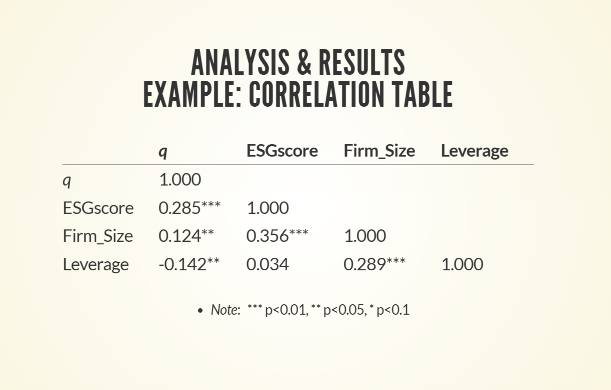

# DS {.Xsmaller}

- ***Data science*** (**DS**): An interdisciplinary field combining
  math, statistics, programming, and business knowledge to ***turn raw,
  messy data into useful insights***.

- Traditional DS courses provide [**comprehensive**
  coverage](https://www.udemy.com/course/python-core-and-advanced/) of a
  programming language (e.g., **Python** or R), building a solid
  foundation from the ground up

- ***Downside***:

  - Overwhelmed by details, students can lose sight of ***what matters
    most*** to formulating and implementing a solution to their problem


# Our Strategy

- ***One day is too short*** for developing the knowledge and know-how
  comprehensively using the traditional approach

- Instead, this workshop simply

  - showcases some [code examples]{style="color:green;"} (primarily in **Python**) with which students can [***modify and experiment***]{style="color:green;"} to turn them into ***their own projects*** through learn by doing
    - using ***AI as a learning and research
      [partner]{style="color:green;"}***


# Why Python? {.Xsmaller}

- Python has become the undisputed industry standard due to an
  ***unmatched ecosystem of pre-built tools***

- In late 1990s, 
  - the scientific and academic computing communities
  adopted Python for mathematics and research

- As the "Big Data" and AI boom later took off, 
  - researchers naturally built their new machine learning tools on top of the Python code they already knew


## Shell vs GUI

- Code development in Python/R is often done in a *click-and-select*
  interface, i.e., **graphical user interface** (**GUI**)

- A **shell / terminal** lets you

  - interact with the computing environment using a **command line
    interface** (**cli**)

- A cli is not as user-friendly as a GUI

  - but can chain code in script files together for ***automated/batch
    processing***


## Jupyter Notebook {.Xsmaller}

- **Jupyter** Notebook/JupyterLab is an industry-standard GUI for
  _experimenting with and annotating_ Python code,
  - combining code, text, and visualizations in a single document

- It has two types of **cells**:
  - **Code** cells contain code that can be executed to produce output
    (e.g., tables, plots, numerical or textual results)
  - **Markdown** cells contain text formatted using Markdown syntax


## Markdown {.smaller}

- A lightweight markup language for creating formatted text, such as
  headings, lists, links, and emphasis, using simple ***plain-text
  syntax***

- It is the native language for AI assistants to understand and generate
  text,

  - making it a natural choice for documenting code and data analysis
    workflows

- **Quarto**, an industry-standard tool for creating reproducible
  documents, also uses Markdown to format text

  - e.g., this slidedeck was created with [Quarto using Markdown syntax](https://quarto.org/docs/authoring/markdown-basics.html)


# Story behind Jupyter notebook

- [Embedded in the
  name](https://blog.jupyter.org/i-python-you-r-we-julia-baf064ca1fb6)
  [**Ju**]{style="color: #1f77b4;"}[**py**]{style="color: #ff7f0e;"}te[**r**]{style="color: #2ca02c;"}
  are letters representing
  - three major data science programming languages:
    - [Python]{style="color: #ff7f0e;"}, [R]{style="color: #2ca02c;"},
      and [Julia]{style="color: #1f77b4;"}
- [**Julia**](https://julialang.org/), a high-performance language, is a
  topic for another day
- **R** since its [**tidyverse**](https://tidyverse.org/) era has become
  very user-friendly for data analysis and visualization


## R vs Python {.smaller}

- **Python**
  - a general-purpose programming language widely used for data analysis
    and **machine learning** (**ML**)
- **R**
  - a programming language specially designed for **statistical
    computing** and data analysis
- Their capability can be significantly expanded through importing
  - **libraries** (aka. **packages**) specialized in performing certain
    functions with commands outside the base language


## R and Python {.smaller}

- Today, the data science related functionalities of the two languages
  have become very similar
  - Can often find similar libraries for both languages
    - e.g., **dplyr** for R and **pandas** for Python are powerful
      libraries for working with dataframes\
  - Can *call R from Python* using the **rpy2** library
    - can also *call Python from R* using the **reticulate** package

```{=html}
<!--
## Shell vs GUI  

- Code development in Python/R is often done in a _click-and-select_ interface, i.e., **graphical user interface** (**GUI**)

- A **shell / terminal** lets you 
  - interact with the computing environment using a **command line interface** (**cli**) 
  
- A cli is not as user-friendly as a GUI
    - but can chain code in script files together for _**automated/batch processing**_
-->
```


## File formats of code {.smaller}

`myscript` below refers to a script file containing programming code

- **Python**:
  - `.ipynb`: Python code in **Jupyter notebook** format
    - convenient for code development (not for shell use)
  - `.py`: Python code in script format (or marimo notebook as a script)
    - command to execute in shell:   `python3 myscript.py`
  - [**marimo**]{style="color:green;"} notebook offers the [***best of
    both worlds***]{style="color:green;"}
- **R**:
  - `.rmd`: R code in **Rmarkdown** notebook format
    - convenient for code development (not for shell use)
  - `.r`: R code in script format
    - command to execute in shell:   `Rscript myscript.r`


# Cloud computing platforms {.Xsmaller}

The following two platforms have free-tier accounts that let you try Python/R conveniently:

- *GitHub Codespaces* has [**VS Code**](https://code.visualstudio.com/)
  as its GUI
  - native for **GitHub Copilot**
    <!--  - provided by **GitHub**, a home of numerous _**open-source**_ packages
    -->

- [***Posit cloud***](https://posit.cloud/) has
  [**RStudio**](https://posit.co/download/rstudio-desktop/) (for **R**)
  as its GUI
  - Can use **GitHub Copilot**
    - but only for inline queries and code generation in the editor


## Why GitHub, GitHub Codespace, and GitHub Copilot? {.smaller}

- **GitHub** provides spaces to *store, manage, and share code* with
  others

  - Code files of a project are organized in a ***repository***
    (***repo***) with ***version control*** to track changes

- GitHub **Codespace** (built on **VS Code**) provides a ***ready-to-use
  development environment*** in the cloud, without requiring the setup of
  VS Code in a local machine

- GitHub **Copilot** is an ***AI assistant*** sitting inside
  Codespace/VS Code to

  - answer your questions (***Ask*** mode)
  - formulate plans to implement your ideas (***Plan*** mode)
  - act as your agent to execute the plans to generate code and verify
    the results (***Agent*** mode)


## GitHub ecosystem {.smaller}

{fig-align="center" width="120%"}

```{=html}
<!--
{fig-align="center" style="max-width:120%;height:auto;"}
-->
```


## GitHub Codespace: Layout {.smaller}

- Centre Panel: **Code editor** area

- Tabs on Left Panel: 
  - **Explorer**, Search, Source Control, ..., Extensions, ...

- Tabs on Bottom Panel:
  - ... | **Terminal** | ...  
  | Jupyter (visible when a Jupyter notebook is opened) | ...

- Right Panel: Chat box for **GitHub Copilot**
  - Mode selection (Agent, **Ask**, Plan)
  - Model selection ( **Auto** only for free-tier)

- Panel toggle buttons (upper right corner)


# Workshop repo on GitHub {.smaller}

- [**TrainingWorkshop**](https://github.com/DrAYim/TrainingWorkshop): Click this to see the repo's landing page

- A Jupyter notebook in the repo contains code and brief comments to introduce essential Python commands for beginners

- To go through the comments in markdown and execute the code cells, 
  - create a **GitHub Codespace** from the repo using the green <span style="color: green;">**Code**</span> button
  - Once ready (i.e., nothing in the Codespace window still spins), 
    - find the notebook `prelim2_Jupyter_PythonBasics.ipynb` in the **Explorer** tab on the left panel and click to open the notebook
    - use the **Select Kernel** button (upper right of centre panel) to choose a Python 3.xx kernel

- When hovering over a code cell, you will see an **Execution** button (▶️) appearing on the left side of the cell
  - Click it to execute the code cell and see the output below it


## Things to note {.smaller}

- Be patient as it may take over **12 minutes** to create the Codespace for the first time; subsequent visits require less than 30 seconds to wake it up
  - DON'T start working until the Codespace is ready, or the interruption can result in a _**corrupted**_ Codespace

- _"Do you trust the authors of the files in this folder? Creating a terminal process requires executing code ..."_ → click **Trust Folder and Continue** 

- _"The workspace has tasks (Run setup on open) defined ... Do you want to allow automatic tasks to run in all trusted workspaces?"_ → click **Allow** 

- _"Python completions and type diagnostics are unavailable because ..."_ → click **Don't Show Again** 

- _"OpenCode: enabled VS Code's Agents ..."_ → click **Reload Now**  

- _'Would you like Visual Studio Code to periodically run "git fetch"?'_ → click **Yes** 

<!-- - _"Extension activation failed, run the 'Developer: Toggle Developer Tools' command for more information"_  → click **Install** 
- _"The Jupyter extension is not installed. Install it to enable notebook support."_  →  click **Install**  -->


# RStudio project on Posit cloud {.smaller}

- **Project** in Workspace on *Posit cloud*
  - is like **Codespace** on GitHub
- See the shared Project:
  - [**Result_Tables_Using_R**](https://posit.cloud/content/12144701)

- The Rmarkdown notebook `prelim3_ResultTables.Rmd` in the Project contains code to generate the **descriptive statistics, correlation, and regression** tables presented in the second half of this slidedeck
  - The Jupyter notebook `prelim3_ResultTables.ipynb` in the Workshop repo is a Python version of the same code


  
::: {style="font-size: 180%; font-weight: 400; text-shadow: 0px 0px 10px rgba(0, 0, 0, 0.5);"}  
# Data Analysis Workflow
:::


## Data Workflow Overview { data-state="wide" }

::: {style="margin-top:100px;"}
<!-- Must not wrap mermaid code, or it will not render properly -->
:::

<!-- 
{ data-state="wide" } requied for per-slide customization; 
Break mermaid text into as many lines as possible to avoid overspilling;
Height of mermaid node adjusts automatically 
-->
```{mermaid}
---
config:
  themeVariables:
    fontSize: 9px
---
flowchart LR
C["Data 
  Collection"] 
  C --> D[Data 
  Preparation 
  & Cleaning]
  D --> E[Model 
  Development]
  E --> F[Analysis 
  & Results]
  F --> G[Robustness 
  Tests]
  G --> H[Conclusion 
  & Implications]
     
  style C fill:#d4f1f9,stroke:#05386B
  style D fill:#d4f1f9,stroke:#05386B
  style E fill:#d4f1f9,stroke:#05386B
  style F fill:#d4f1f9,stroke:#05386B
  style G fill:#d4f1f9,stroke:#05386B
  style H fill:#d4f1f9,stroke:#05386B
```

<!-- ![DataWorkflowOverview]

[DataWorkflowOverview]: img/DataWorkflowOverview.jpg "Data Workflow Overview" {fig-align="center" height=auto width=1500px max-width=120% }

{fig-align="center" width="120%"}  -->


## Data Collection Strategy { data-state="wide" }

::: {style="margin-top:200px;"}
<!-- Must not wrap mermaid code, or it will not render properly -->
:::

<!-- 
{ data-state="wide" } requied for per-slide customization; 
Break mermaid text into as many lines as possible to avoid overspilling;
Height of mermaid node adjusts automatically 
-->
```{mermaid}
---
config:
  themeVariables:
    fontSize: 9px
---
flowchart LR
    A[Identify Required 
    Variables for a 
    Research Question] --> B[Map to 
    Available 
    Data Sources]
    B --> C[Check 
    Data 
    Availability]
    C --> D{Sufficient
    Coverage?}
    D -- Yes --> E[Extract & Move on]
    D -- No --> F[Modify Research 
    Scope/Question]
    F --> A
    
    style A fill:#e6f7ff,stroke:#0066cc
    style B fill:#e6f7ff,stroke:#0066cc
    style C fill:#e6f7ff,stroke:#0066cc
    style D fill:#ffeecc,stroke:#ff9900
    style E fill:#e6ffe6,stroke:#009900
    style F fill:#ffe6e6,stroke:#cc0000
```

<!-- ![DataCollectionStrategy]

[DataCollectionStrategy]: img/DataCollectionStrategy.jpg "Data Collection Strategy" { height=auto width=1500px max-width=100% } -->


## Data Sources Available at Bayes

::: {style="margin-top:40px; font-size:70%;"}
| Data Type | Data Source | Content |
|:---------:|---------------------|---------------------|
| Financial  | **Compustat** (North America & Global) | Balance sheet, income statement, cash flow data |
| Financial | Capital IQ: Capital Structure | Detailed capital structure information |
| Market  | **CRSP** (also, **CRSP-Compustat Merged**) | Stock prices, returns, trading volume |
| Market  | Datastream | Global equities, economics, commodities data |
| Banking  | Bank Regulatory Database | Bank structure, call reports, holding company financials |
| **...**  |||
|  |||
:::


# Example: Research on ESG and Firm Value {.smaller}

- **Research Question**: 
  - _Does superior ESG performance increase firm value for listed companies?_

- **Key Variables**:
  - **Dependent Variable**: <span style="color:darkred">**Tobin's _q_**</span> as a proxy for firm value
  - **Independent Variable**: <span style="color:darkred">**ESG score**</span>
  - **Control Variables**: Firm size, leverage, profitability, etc.

- **Sample**: 
  - Listed companies from **CRSP-Compustat Merged** database
  - Merged with ESG data in the dataset from Ch. 5 of https://www.greenfinance.education


## Tobin's _<span style="text-transform: lowercase !important;">q</span>_ and ESG score 

- What is **Tobin's _q_**?
- What is **ESG**?

<br>

<div style="text-align: center;">When you do not understand something, <span style="color:green">_**AI is your friend!**_</span> (ask [**Claude**](https://claude.ai/new))</div>


## Data Preparation & Cleaning (Before Analysis)

- **Initial assessment**:
  - _**Summary statistics**_ for all variables
  - _**Missing data**_ patterns and outlier identification

- **Common cleaning procedures**:
  - Outlier treatment: 
    - e.g., _**winsorization**_: Typically at 1% and 99%
  - Variable transformation: 
    - e.g., _**logarithmic**_ (`log`): Turn a skewed distribution close to normally distributed


## Model Development<br>Example: Regression Models {.smaller}

- **Pooled OLS regression**:
  - Basic approach combining _cross-sectional and time-series_ data
  - Example:  
  $q_{i,t} = \alpha + \beta_1 ESGscore_{i,t} + \beta_2 Controls_{i,t} + \varepsilon_{i,t}$

- **Year and industry indicators**:
  - Control for _time trends and industry differences_
  - e.g., $q_{i,t} = \alpha + \beta_1 ESGscore_{i,t} + \beta_2 Controls_{i,t}$  
&emsp; &emsp; &emsp; &emsp; &emsp; $+ \beta_3 \sum Year_t + \beta_4 \sum Industry_i + \varepsilon_{i,t}$


## What are year and industry indicators used in regression?

- Ask [**Gemini**](https://gemini.google.com/)!


# Analysis & Results<br>Example: Descriptive statistics table

::: {style="margin-top:40px; font-size:70%;"}
| Variable &emsp; | N  | &nbsp; Mean | Median | Std. Dev. |  &nbsp; Min  |  &nbsp; Max |
|---------|:-----:|-----:|------:|-------:|-----:|-----:|
| _q_ | 4,200 | 1.82 | 1.56 | 0.94 | 0.78 | 4.65 |
| ESGscore | 4,200 | 65.34 | 67.00 | 18.45 | 12.00 | 95.00 |
| Firm_Size | 4,200 | 8.45 | 8.32 | 1.75 | 4.62 | 12.85 |
| Leverage | 4,200 | 0.42 | 0.39 | 0.21 | 0.04 | 0.93 |
:::


## Descriptive statistics table

- _How to produce the descriptive statistics table in the attached screenshot (using Python)?_
  - Ask [**Qwen**](https://chat.qwen.ai/) (after uploading the screenshot below)!

{fig-align="center" height=500px width=auto max-width=100% }


## Analysis & Results<br>Example: Correlation table

::: {style="margin-top: 40px; font-size:70%;"}
|  | _q_ &emsp; &emsp; | ESGscore &emsp; | Firm_Size &emsp; | Leverage| 
|------------|----------|----------|----------|----------|
| _q_ | 1.000 |  |  |  |  
| ESGscore | 0.285*** &emsp; | 1.000 |  |  | 
| Firm_Size &emsp; | 0.124** | 0.356*** | 1.000 |  | 
| Leverage | -0.142** | 0.034 | 0.289*** | 1.000 |
:::

<div style="text-align:center; font-size:65%; margin-top:20px;">• &emsp; _Note_: &nbsp; \*\*\* p\<0.01, \*\* p\<0.05, \* p\<0.1 </div>


## Correlation table

- _How to produce the correlation table in the attached screenshot  (using Python)?_
  - Ask [**Grok Fast**](https://grok.com/) (after uploading the screenshot below)!

{fig-align="center" height=500px width=auto max-width=100% }


## Analysis & Results<br>Example: Regression table

::: {style="margin-top: 15px; font-size:70%;"}
| Variable | Model 1 | Model 2 | Model 3 | Model 4|
|-------------------|-------------|-------------|-------------|---------|
| ESGscore | 0.027*** | 0.024*** | 0.022*** | 0.021*** |
|           | (0.008) | (0.007) | (0.007) | (0.007) |
| Firm_Size |         | -0.128*** | -0.132*** | -0.135*** |
|           |         | (0.035) | (0.034) | (0.034) |
| Leverage  |         | -0.745* | -0.732*** | -0.728** |
|           |         | (0.371) | (0.154) | (0.236) |
| Industry Indicators| No | No | Yes | Yes |
| Year Indicators | No | No | No | Yes |
| Observations | 4,200 | 4,200 | 4,200 | 4,200 |
| R-squared | 0.081 | 0.298 | 0.325 | 0.337 |
:::

<div style="text-align:center; font-size:65%; margin-top:20px;">• &emsp; _Note_: &nbsp; Standard errors in parentheses; &nbsp; \*\*\* p\<0.01, \*\* p\<0.05, \* p\<0.1 </div>


## Analysis & Results<br>Example: Robustness Checks

::: {style="margin-top: 40px; font-size:70%;"}
| Variable | Main Results | Alternative<br>ESG Measure | Subsample: <br>Large Firms | Subsample: <br>2010-2019 |
|-----------------------|--------------|-----------------|-----------------|-------------|
| ESGscore | 0.021*** | 0.018** | 0.025*** | 0.019** |
|           | (0.007) | (0.008) | (0.009) | (0.008) |
| Controls  | Yes | Yes | Yes | Yes |
| Industry Indicators  | Yes | Yes | Yes | Yes |
| Year Indicators | Yes | Yes | Yes | Yes |
| Observations | 4,200 | 4,050 | 2,340 | 2,100 |
| R-squared | 0.337 | 0.328 | 0.356 | 0.342 |
:::

<div style="text-align:center; font-size:65%; margin-top:20px;">• &emsp; _Note_: &nbsp; Standard errors in parentheses; &nbsp; \*\*\* p\<0.01, \*\* p\<0.05, \* p\<0.1 </div>


# Thank you!


<!--

[• Master this module to &emsp; &emsp; &emsp; &emsp; &emsp; &emsp; &emsp; &emsp; &emsp; &emsp; &emsp; &emsp; &emsp; &emsp; &emsp; &nbsp; &nbsp; &nbsp; &thinsp; &thinsp; ]{.sp .fragment .fade-in-then-out style="margin-top:0; margin-bottom:-10px;"} 


## The Answer 

[• You will not be replaced by AI]{.sp .fragment .fade-in-then-out}  

[• You will be replaced by someone who can **use AI better** &emsp; &nbsp; &nbsp; &nbsp; &thinsp; **than you**]{.sp .fragment .fade-up}


{fig-align="center" height=500px width=auto max-width=100% }


![XYZ]

[XYZ]: img/DataCollectionStrategy.jpg "Data Collection Strategy" { height=auto width=1500px max-width=100% }


# Why automation with code? {.smaller}

::: incremental
- **Repetitive tasks** can be automated to *save time and reduce errors*
- **Scalability**: Automation allows *scaling out in parallel* if needed
:::

:::: {.fragment .fade-up}
<div style="text-align: center;">[[**Code enables**]{style="color:green;"} **knowledge accumulation and transfer**]{style="margin-top:0;"}</div>
::::


# To conclude

- This module was designed to equip you with the **data literacy** to 
  - **adapt to** any new tool **the future** of finance and accounting throws at you

<div style="text-align: center;">[Helping you to [**stand out**]{.gold-glow} in the talent pool!]{.sp .fragment .fade-up style="font-size:150%;margin-top:0;"}</div>

<!-- 3. CSS for this specific effect --\>
<style>
/* 
   Style for the container to remove extra gaps 
   and center the text 
*/
.gold-glow {
  text-align: center;
  margin-top: 0 !important; /* Removes the gap above */
  padding-top: 10px;
  
  /* Text Styling */
  font-family: lato;  
  font-size: 1.8em; /* Large but fits on slide */
  line-height: 1.2;
  color: #3f3530; /* Dark Brown (matches Beige theme text) */
  
  /* The Animation */
  animation: pulse-gold 0.65s infinite alternate;
}

/* 
   Keyframes for a "Gold/Bronze" Pulse 
   Optimized for Light Backgrounds
*/
@keyframes pulse-gold {
  0% {
    /* Subtle Gold Halo */
    text-shadow: 0 0 5px rgba(184, 134, 11, 0.2); 
    transform: scale(1.0);
  }
  100% {
    /* Intense Gold Glow */
    text-shadow: 0 0 70px rgba(184, 134, 11, 0.6), 
                 0 0 10px rgba(218, 165, 32, 0.8);
    transform: scale(1.9); /*  "breathing" effect */
  }
}
</style>

-->