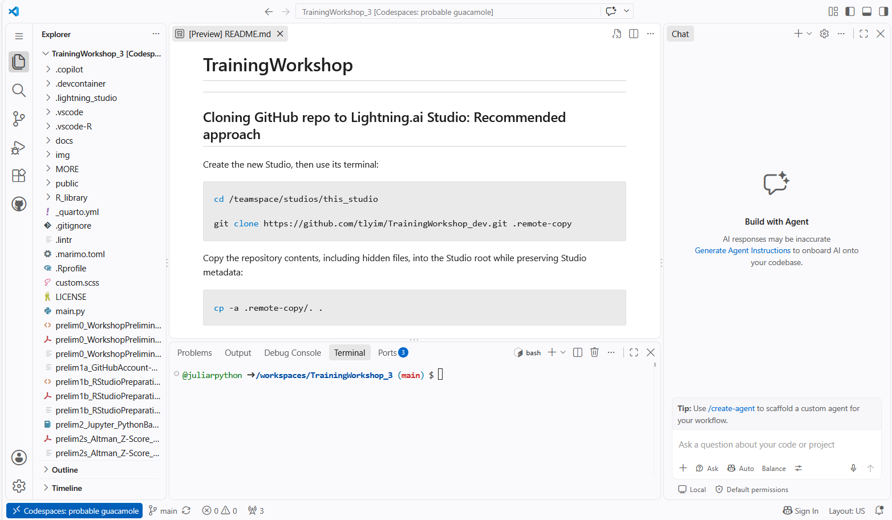
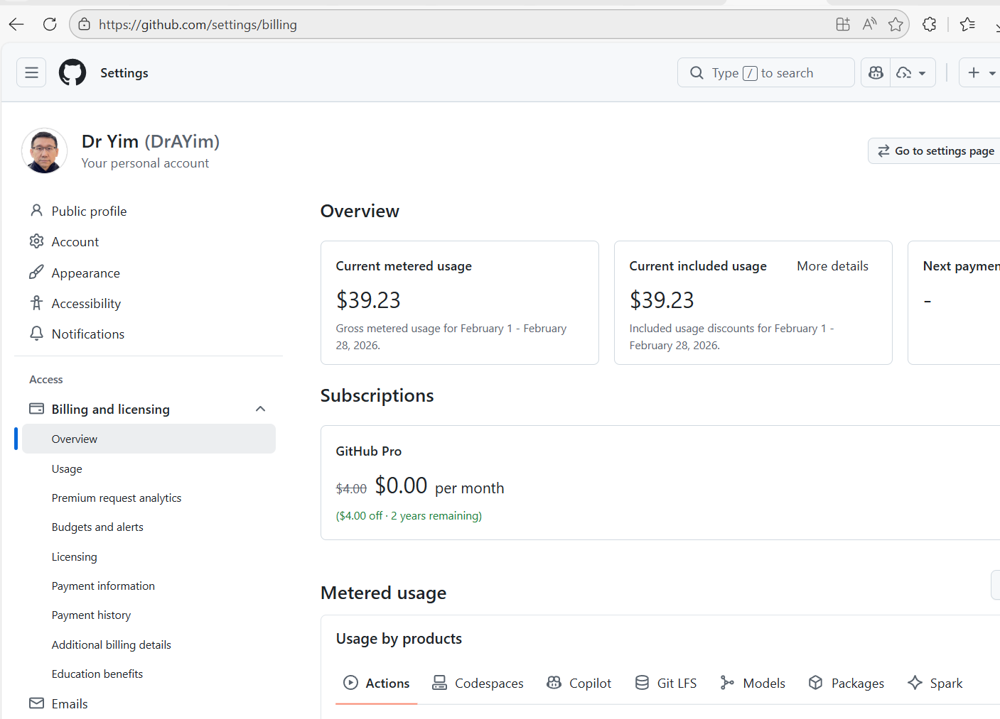
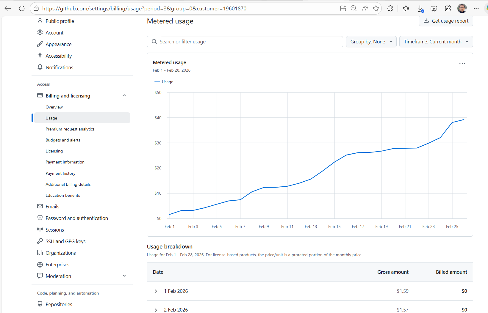
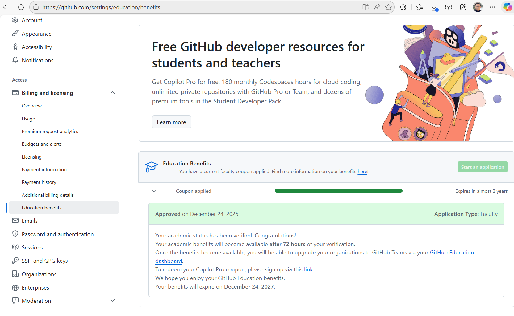
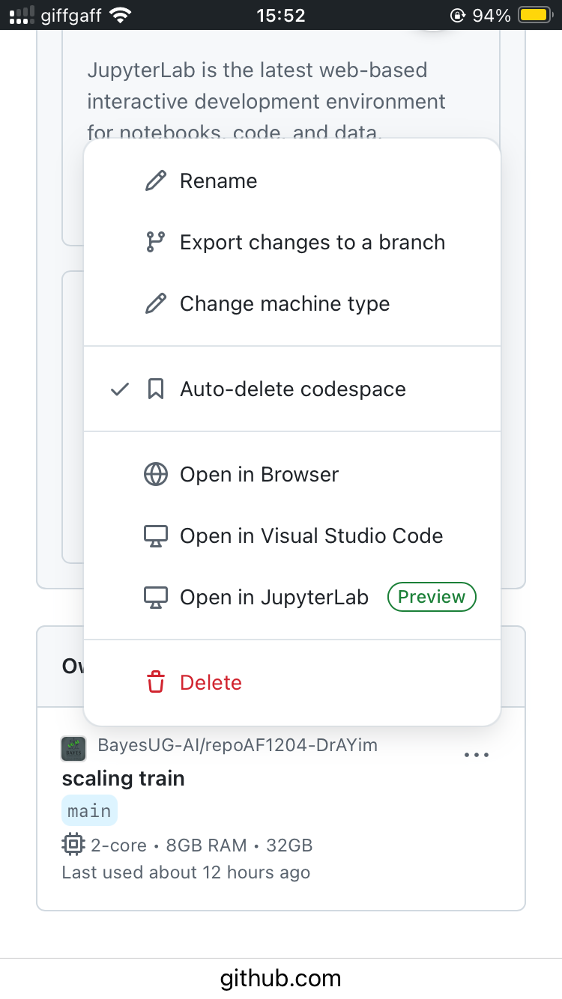
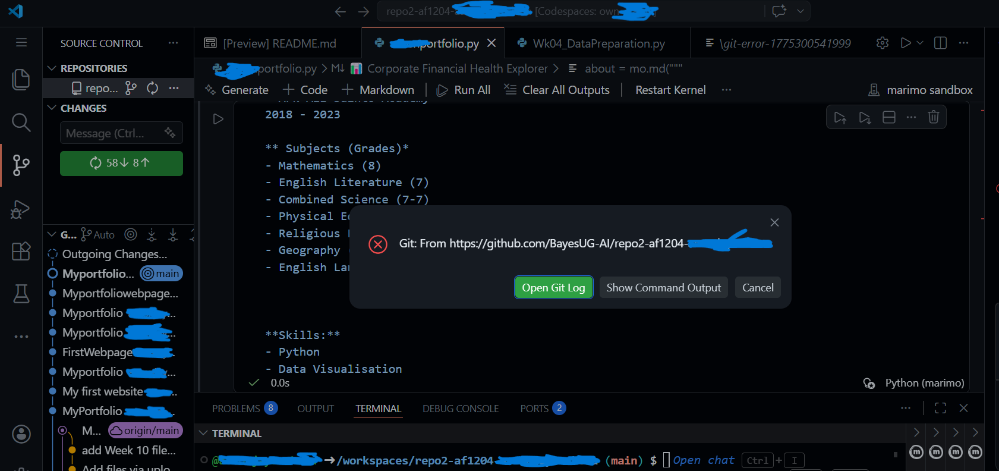

## 1. Why GitHub, GitHub Codespace, and GitHub Copilot? {.smaller}

- **GitHub** provides spaces to *store, manage, and share code* with
  others
  - Code files of a project are organized in a ***repository***
    (***repo***) with ***version control*** to track changes

- GitHub **Codespace** (built on **VS Code**) provides a ***ready-to-use
  development environment*** in the cloud, without requiring the setup of
  VS Code in a local machine

- GitHub **Copilot** is an ***AI assistant*** sitting inside
  Codespace/VS Code to
  - answer your questions (***Ask*** mode)
  - formulate plans to implement your ideas (***Plan*** mode)
  - act as your agent to execute the plans to generate code and verify
    the results (***Agent*** mode)

{fig-align="center" width="120%"}

## 2. GitHub Account and GitHub Copilot

- Make sure your device is relatively recent (hence, with a _**modern browser**_) and the browser is _**up to date**_
  - For example, in Chrome, click the vertical **trip-dot (⋮)** on the upper right corner to see a dropdown menu, then select `Help` | `About Google Chrome` to update the browser

- Sign up for a free-tier GitHub account, which comes with various benefits, including limited monthly credits for using **GitHub Codespaces** and **Github Copilot**
  - <https://github.com/signup>

- During the signup process, 
  - **Do NOT** click _Continue with Google/Apple_ on the page to create your account
  - Use your _**university email address**_ to create the account. Do NOT use your personal email account. 
      - Otherwise, you will not be eligible to also apply for joining **GitHub Education** with even more benefits.
  - Choose a GitHub _**username**_ and _**password**_
  - You will be asked to _**verify your identity via a code**_ sent to your university email
  - You might also be asked to solve _**up to 10 puzzles**_ to verify that you are a human, not a bot.
<!-- - After creating your free GitHub account, remember to **report your** **GitHub username** using this [feedback link](https://moodle4.city.ac.uk/mod/feedback/view.php?id=1196052) so that we can connect your GitHub username and university email address together for distributing project assignment repos. -->

- Next, follow the instructions on this page (<https://github.com/settings/education/benefits>) to apply for **GitHub Education** benefits:
  - **Verified students** can get "Copilot for free, 180 monthly Codespaces hours for cloud coding, unlimited private repositories with GitHub Pro or Team, and dozens of premium tools in the Student Developer Pack."
  - _**Note:**_ It can take over **five working days** to obtain the approval for the additional benefits even if all the required documents are submitted properly

- To enable GitHub Copilot features, visit: <https://github.com/settings/copilot/features>
  - If it doesn’t show that GitHub Copilot is enabled, click the button to enable the option to use **GitHub Copilot**. 

## 4. Create a GitHub Codespace from a GitHub repo

- On a GitHub repo's landing page, click on the green **Code** button
  - A dialog box (with two tabs in it) will open on the repo page
  - In the **Codespaces** tab of the dialog box, click on the long green **Create Codespace on main** button.
  - A new tab will open in your browser, which will contain the Codespace created from the repo 
    - _**Note:**_ A Codespace of the shared repo can take **over 12 minutes** to create for the first time; subsequent visits need less than 30 seconds to wake the Codespace from sleep mode

- Be patient to wait until everything appears to have **stopped loading** (i.e., nothing is spinning, especially in the **button bar** on the left and the **status bar** at the bottom).
  - Otherwise, a corrupted Codespace with **unpredictable behaviors** may result
    - If this happens, you should delete the Codespace and create a new one from the repo

- Once the Codespace is created, you will see various messages popping up. Below are the recommended actions: 
  - _"Do you trust the authors of the files in this folder? Creating a terminal process requires executing code ..."_ → click **Trust Folder and Continue** 
  - _"The workspace has tasks (Run setup on open) defined ... Do you want to allow automatic tasks to run in all trusted workspaces?"_ → click **Allow** 
  - _"Python completions and type diagnostics are unavailable because ..."_ → click **Don't Show Again** 
  - _"OpenCode: enabled VS Code's Agents ..."_ → click **Reload Now**  
  - _'Would you like Visual Studio Code to periodically run "git fetch"?'_ → click **Yes** 
<!-- - _"Extension activation failed, run the 'Developer: Toggle Developer Tools' command for more information"_  → click **Install**  -->
<!-- - _"The Jupyter extension is not installed. Install it to enable notebook support."_  →  click **Install**  -->

- There are four panels in the Codespace: 
  - Centre Panel: **Code editor** area
  - Tabs on Left Panel: 
    - **Explorer**, Search, Source Control, ..., Extensions, ...
  - Tabs on Bottom Panel:
    - ... | **Terminal** | ...  
    | Jupyter (visible when a Jupyter notebook is opened) | ...
  - Right Panel: Chat box for **GitHub Copilot**
    - Mode selection (Agent, **Ask**, Plan)
    - Model selection ( **Auto** only for free-tier)

- There are also three **Panel toggle** buttons on the upper right corner of the Codespace:
  - Orientate yourself around the screen, including all the different panels, and toggle between the different views

{fig-align="center" width="120%"}

## 5. Create a forked repo of a GitHub repo

- Directly creating a Codespace from a GitHub repo owned by another user lets you quickly experiment with the code but you _**cannot save changed/added files**_ to the repo, which is not owned by you. You can only download the files to keep a copy of them
  - To be able to save changes, you need to create a **fork** of the repo first, which is a copy of the repo that you own and can modify
  - To create a fork of a repo, click the **Fork** button on the upper right corner of the repo's landing page. This will create a copy of the repo under your GitHub account

<!-- 
## 5.X Create your fork of the shared repo

- You will receive an email with an invitation link asking you to **accept a GitHub Classroom assignment**, which is the way we distribute the module repo to you. Clicking on the link will take you to a page on the GitHub website asking you to log into your GitHub account to accept the assignment. After you have done so, you will see a confusing ‘The Assignment repo is not accessible’ message. This is normal because it takes time to create a fork of the shared repo for you.

- Wait up to 2-10 minutes for a ‘@DrAYim has **invited you to collaborate**’ email (sent from **Dr Yim** \<noreply@github.com\>) to arrive in your university email account. 
    - _Note:_ Remember to check the _**Spam**_ folder as well.
- Open the email and click on the blue button (**View invitation**).
    - This will take you through to your version of the shared GitHub repo (or ‘fork’) in your default browser 
-->

## 6. Commit and push changes to a GitHub repo 

- Once you are happy with certain changes to the code in a Codespace created from your original/forked repo, 
  - you can **commit** the changes in the Codespace for the long term and **push** the changes back to the repo on GitHub 

- By giving a **commit message** when you commit and push changes, you can keep track of the changes over time. 
  - This practice sets up **checkpoints** where you can revert to a previous version of the repo if you make a mistake in your code

- To commit and push changes to a repo, click the **Source Control** tab on the left panel of a Codespace and then
  - click the **+** button near the end of the second 'Changes' line (below the **✓ Commit** button) to stage all changes 
  - type a commit message in the text box above the **✓ Commit** button
  - click the **✓ Commit** button to commit the changes
  - finally, click the **three-dot (⋯)** button at the end of the first **Changes** line (above the text box) and select **Push** from the dropdown menu to push the changes back to the repo on GitHub

## 7. FAQs on GitHub and Related Topics

- _**Is it acceptable to move files in and out of the `.devcontainer` folder of my repo?**_
    - You should not touch the `.devcontainer` folder or files inside; otherwise, you might screw up the configuration of a Codespace.

- _**My GitHub Codespace usage limit has run out, and my account indicates it won't reset until the next calendar month begins. Is there an alternative method or setup you recommend that lets me continue using GitHub Codespaces?**_
    - There's not much you can do when it gets to this stage. All the free GitHub services go under a total credit allowance. When it is exhausted, you have to wait until the allowance is replenished in the next monthly cycle. 
        - Given the total credit allowance, you cannot use Codespaces as virtual computers beyond certain hours. The total number of hours available is also affected by the sizes of the Codespaces you have created and kept. The storage usage is on a storage-hour basis in terms of how it consumes the credit allowance. Deleting unused Codespaces can stop bleeding but it won't change the fact that previously credits were wasted on keeping unused Codespaces.
    - Going forward, please consider keeping an eye on the usage from time to time and having a read of the documentation on the pricing for different things: Codespaces storage cost, Copilot, etc. See those pages in the screenshots attached below. I guess some of your Codespaces that went into sleep might have taken up a portion of your storage allowance. It is a good practice to actively delete unused Codespaces and refrain from creating new ones unless absolutely necessary.  
    - Not sure relevant in this particular case but have you followed the advice to apply for [**GitHub Education**](https://github.com/settings/education/benefits) **benefits for verified students**?
    - Worst comes to worst, you might want to consider the paid subscription option. 
    - {width=100%}
    - {width=100%}
    - {width=100%}

- _**I have used up the monthly free credit allowance on GitHub but I am not comfortable providing my bank details to GitHub for purchasing credits. What alternatives do I have?**_
    - FWIW, I ran into a similar situation and had provided my Revolut card details to pay for a subscription. I paid for a pay-as-you-go subscription and added only as much an amount as necessary in my Revolut account to allow payment to GitHub. Since that incident, I managed my usage very carefully and had not run into the same situation again. I also reverted the budget limit back to zero so that GitHub would stop my usage once I hit the monthly allowance (you must raise the budget limit beyond 0 to allow usage once the monthly allowance is reached, and to raise the limit, you must provide a payment method). But the zero budget limit has not been binding since I learned to manage my allowance well. 

- _**I have uncommitted changes in a Codespace created from my repo. Because the credit allowance for this month has been used up, I can no longer reactivate the Codespace to get back the files with the uncommitted changes. The Codespace will be auto-deleted in a few days. What should I do?**_
    - This situation highlights the importance of committing changes regularly and ensuring all changes have been committed before you let a Codespace sleep. If you had, all the changed files are now in your repo permanently. 
    - The only potential rescue I could think of is an export option on the Codespaces dashboard page that might be relevant -- though I am not 100% sure it does serve your purpose here. Anyway, give it a try.
    - {width=50%}

- _**Whenever I try to commit changes and sync my work, the error message in the screenshot below pops up. What should I do?**_ {width=100%}
    - The situation could be a consequence of changing the same file through different channels without always committing back to the repo immediately. For example, at 9:00 on a day you changed a file in the Codespace created from a repo without committing the change back to the repo. At 14:00, you went to the GitHub repo page and directly edited the same file. At 18:00, you worked with the Codespace again and decided to sync your changes in that file back to the repo. At that point, the file in the repo was changed at 14:00, whereas the same file in the Codespace was changed at 18:00. The version controlling system (Git) was not sure which version you really want to keep and therefore would require you to take actions to clearly indicate how you would like the changes to be integrated together. Usually, this would require an interaction with the Git system using the command line interface (cli) to handle properly. The Git Log contains hints on the git commands for consideration. Following through this path requires some technical knowledge on your side. 
    - The exact cause of your case might be different but this is obviously a file conflict situation. A tedious but easy-to-follow approach to resolving the issue is to download all the latest versions of the changed files from the Codespace to your device and then directly upload them back to the GitHub repo. 
        - In the Explorer panel, you can right-click on each file in concern and select Download from the pop-up dropdown menu to download it to your own pc. 
        - Open your GitHub repo page, click on the 'Add file' button next to the green 'Code' button and select 'Upload files'. 
    - When you upload a copy of the same filename to the repo, you give the permission to replace the existing copy. When this is done, all your files in the repo is up-to-date. From thereon, create a new Codespace to continue your work (and delete the old Codespace that could not be synced) and maintain a good practice of always committing changed files back to the repo at the end of each work session. 

- _**We already learned how to use GitHub Codespaces. Why is it useful to learn to use Lightning.ai as an alternative cloud computing platform?**_
    - 4-core CPU sessions on _Lightning.ai_ are entirely free up to the first 4 hours of a session. If you remember to put a Studio (the equivalent of a GitHub Codespace) into sleep at the end of a 4-hour session and then put it back on to refresh the free status, effectively you have free use of 4-core CPU sessions “as long as you want”. 

