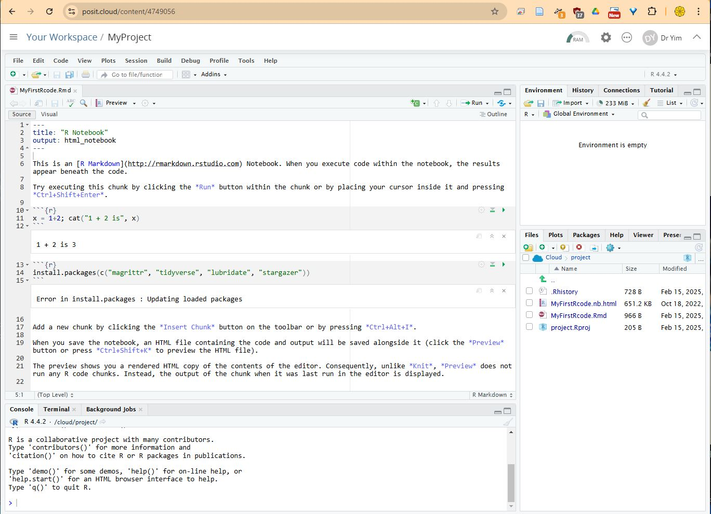

<!-- ## RStudio Preparations  -->

> This document concerns preparations related to RStudio.

1. Sign up for a free Posit Cloud (formerly RStudio Cloud) account and perform your first computation with R

    - Go to [https://posit.cloud/plans/free](https://posit.cloud/plans/free) ; then click the **Sign Up** button under the Cloud Free plan; fill in your email, etc to sign up; **watch for Posit Cloud's email to verify your email address**; go back to [https://posit.cloud/](https://posit.cloud/) to log in

    - Under Your Workspace, click the **New Project** drop-down menu and select **New RStudio Project**, wait for about 25sec before clicking **Untitled Project** to change the project name to **MyProject** and then press the **Enter** key to save it.

    - Click into the Console tab panel somewhere next to the prompt sign (i.e., " **\>** "), then enter **1+2**, followed by hitting the Enter key; you're all set if you see the answer 3.

{fig-align="center" width="120%"}

2. Create and play a code chunk in a newly created R Notebook file

    - [continue from the above] click the "**+**" button right below the "**File, Edit, Code, View, ...**" menu bar and select **R Notebook**; click the **Yes** button to the prompted question; wait for several minutes until the package installation process finishes;

    - click the small icon that looks like a **floppy disk** button (annotated as "*Save current document*") and give the filename **MyFirstRcode.Rmd** to save the newly created file.

    - In the upper-left panel of Posit Cloud, scroll down to look for the code chunk (indicated by the **opening \`\`\`** and **closing \`\`\`**) with the only line **plot(cars)** in it and replace this line by: **x = 1+2; cat("1 + 2 is", x)**

    - then click the small **triangle** icon that looks like a **green arrow** ***Play*** button (annotated as "*Run Current Chunk*") near the right margin of that code chunk in the upper-left panel; you're all set if you see **1 + 2 is 3**.

3. Install R packages {tidyverse}, {modelsummary}, {rstudioapi}, {correlation}, and {stargazer} in your RStudio Cloud account:

    - [continue from the above] move your cursor to **the blank line below the closing \`\`\`** of the first code chunk (i.e., right below the previous displayed output **1 + 2 is 3** ) and click your mouse to position the cursor there

    - then find and click the "**+C**" button (annotated as “*Insert a new code chunk*”) and select **R** from the menu

    - inside the newly inserted code chunk, add the line: **install.packages(c("tidyverse", "modelsummary", "rstudioapi", "correlation", "stargazer"))**

    - then click the small **triangle** icon that looks like a **green arrow** ***Play*** button (annotated as "*Run Current Chunk*") near the right margin of that code chunk; click the **Yes** button to the prompted question; wait for 40sec until the long sequence of installations completes

    - after the installations, click into the Console tab of the lower-left panel of Posit Cloud at somewhere next to the prompt sign (i.e., " **\>** ") and enter the code line **"How_Long_Am_I?" \|\> nchar()** , followed by hitting the Enter key

    - you are all set if you see the answer 14 (which is the count of the number of **blue** characters)
